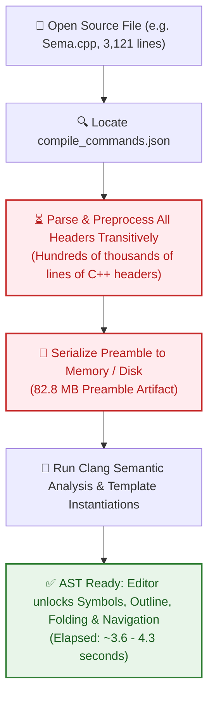
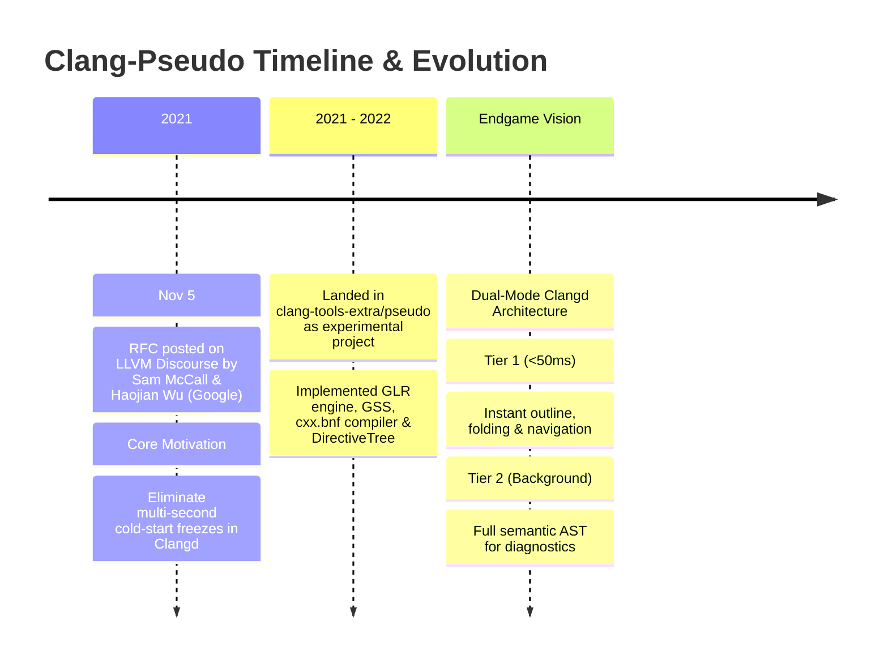
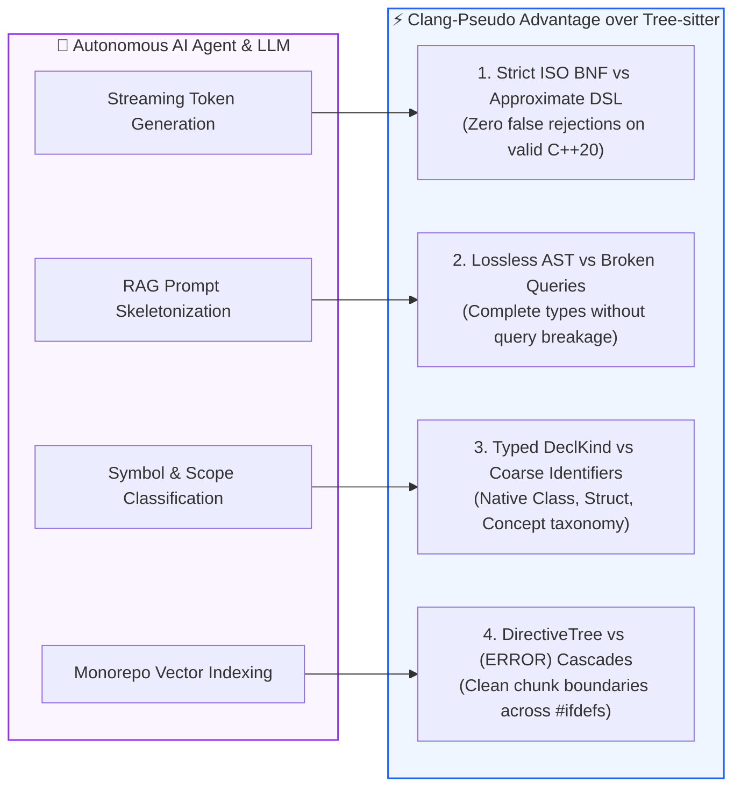
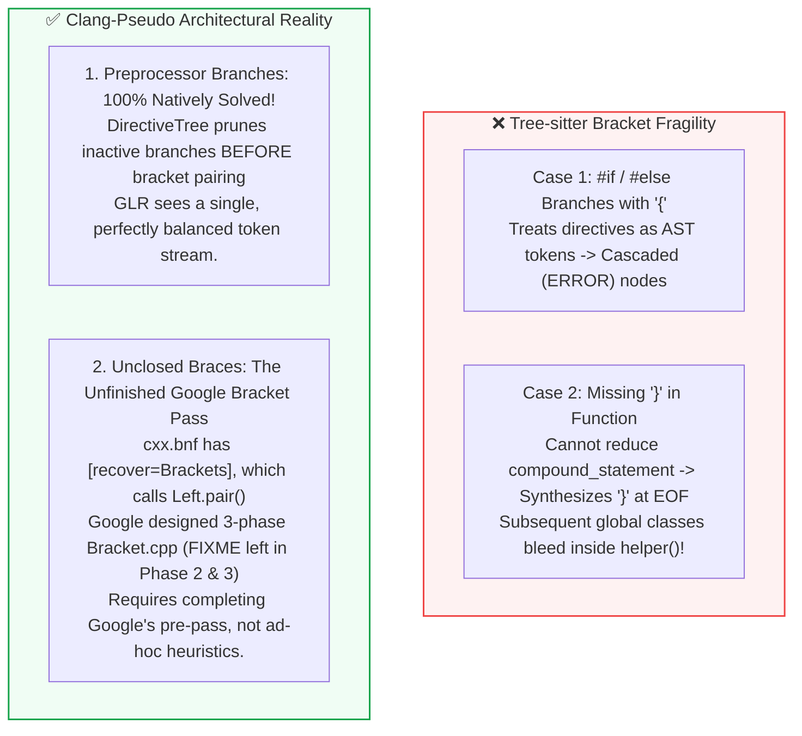

# 📽️ Presentation: Instant C++ Tooling with Clang-Pseudo
### Sub-Second Syntax Navigation, Preprocessor Resilience & Fallback Intelligence for Clangd

<p align="center">
  
  
  
  
  
</p>

> [!TIP]
> **Viewing on GitHub**: This presentation is formatted as an executive slide deck in GitHub Flavored Markdown.  
> - Use the **Slide Navigator** below to jump directly to any slide.
> - Each slide features **◀ Previous** and **Next ▶** quick links for seamless browsing.
> - Expand the collapsible **🎙️ Presenter Notes & Talking Points** on each slide for deep-dive speaker context.
> - All architecture and workflow diagrams are rendered natively by GitHub using **Mermaid**.

---

<a id="slide-navigator"></a>

## 📑 Slide Navigator

| # | Slide Title | Key Takeaway | Quick Jump |
| :-: | :--- | :--- | :-: |
| **01** | [**Title & Executive Summary**](#slide-1) | Sub-second syntax navigation & 590x smaller memory footprint | [View Slide 1 ➡](#slide-1) |
| **02** | [**The Problem: The Cost of Full Clang ASTs**](#slide-2) | Header preprocessing freezes (3.6s), RAM bloat & fragility | [View Slide 2 ➡](#slide-2) |
| **03** | [**Origin & Timeline: When Was Clang-Pseudo Introduced?**](#slide-3) | Nov 2021 RFC by Sam McCall & Haojian Wu (Google), Dual-Mode vision | [View Slide 3 ➡](#slide-3) |
| **04** | [**Why Did Google Developers Stop Work on It?**](#slide-4) | Disambiguation complexity, shift in priorities & today's AI opportunity | [View Slide 4 ➡](#slide-4) |
| **05** | [**Why Pseudo-Parser Beats Tree-sitter: IDE Perspective**](#slide-5) | ISO standard BNF, Parse Forest DAG, DirectiveTree & DeclKind taxonomy | [View Slide 5 ➡](#slide-5) |
| **06** | [**Why Pseudo-Parser Beats Tree-sitter: AI & LLM Perspective**](#slide-6) | Formal ISO validation, lossless RAG skeletonization & ambiguity-aware DAG | [View Slide 6 ➡](#slide-6) |
| **07** | [**Study 1: Preprocessor Resilience (Branch Brackets)**](#slide-7) | `#if` / `#else` branch brackets natively handled without heuristics | [View Slide 7 ➡](#slide-7) |
| **08** | [**Study 2: Real ISO Grammar vs. Handcrafted DSL**](#slide-8) | C++20 Concepts & Constrained Templates (`cxx.bnf` vs `grammar.js`) | [View Slide 8 ➡](#slide-8) |
| **09** | [**The Bracket Dilemma: Preprocessor Branching vs. Unclosed Braces**](#slide-9) | Native DirectiveTree branch pruning vs. Google's unfinished bracket pass | [View Slide 9 ➡](#slide-9) |
| **10** | [**Summary: Strategic Value & Future Roadmap**](#slide-10) | Filling the missing middle of C++ tooling for humans & AI agents | [View Slide 10 ➡](#slide-10) |

---

<br>

<a id="slide-1"></a>

> <sub>**SLIDE 01 OF 10** &nbsp;|&nbsp; [📑 Index](#slide-navigator) &nbsp;|&nbsp; [Next: The Problem ▶](#slide-2)</sub>

# 🚀 Slide 1: Instant C++ Tooling with Clang-Pseudo
### Sub-Second Syntax Navigation & Fallback Intelligence for Clangd

> [!NOTE]
> **Executive Summary**  
> By integrating the Generalized LR (`GLR`) C++ pseudo-parser into `clangd` as a modular `FeatureModule`, we achieve **sub-50 millisecond interactive file opening**—a **~72x speedup** over traditional Clang AST construction on real-world files, while slashing memory consumption by **~590x**.

### High-Level Metric Snapshot

| Dimension | Traditional Clang AST | Clangd + PseudoModule | Impact |
| :--- | :---: | :---: | :---: |
| **`didOpen` &rarr; Ready** | `3,601 ms` (~3.60 s) | `50.2 ms` (~0.05 s) | ⚡ **72x Faster** |
| **Memory Footprint** | `82.8 MB` Preamble | `140 KB` Parse Forest | 📉 **590x Less RAM** |
| **Compilation Database** | **Required** (Strict `compile_commands.json`) | **Optional** (Zero-Config Fallback) | 🛡️ **Resilient** |
| **Header Dependencies** | Must parse all transitively | None required for file syntax | 🌐 **Self-Contained** |

<details>
<summary>🎙️ <b>Presenter Notes & Talking Points</b> (click to expand)</summary>

- **Opening Hook:** "Every C++ developer knows the frustration of opening a file and staring at a frozen editor for 5 to 10 seconds while the language server digests half a million lines of included headers."
- **Core Value Proposition:** Clang-Pseudo completely decouples initial file browsing and structural navigation from exhaustive compiler semantic analysis.
- **The Core Metric:** On `clang/lib/Sema/Sema.cpp` (3,121 lines), regular Clang takes **3.6 seconds** and **82.8 MB** of RAM before the user gets document symbols. With Clang-Pseudo, it takes **50 milliseconds** and **140 KB** of RAM.
</details>

<div align="right">
  <sub><a href="#slide-navigator">⬆ Top</a> &nbsp;|&nbsp; <a href="#slide-2">Next: The Problem ➡</a></sub>
</div>

---

<br>

<a id="slide-2"></a>

> <sub>**SLIDE 02 OF 10** &nbsp;|&nbsp; [◀ Prev: Summary](#slide-1) &nbsp;|&nbsp; [📑 Index](#slide-navigator) &nbsp;|&nbsp; [Next: Timeline ▶](#slide-3)</sub>

# ⚠️ Slide 2: The Problem: The Cost of Full Clang ASTs

In standard `clangd`, providing language intelligence requires constructing a complete Clang AST with precompiled headers (PCH) and preamble.



### Production Pain Points

> [!WARNING]
> 1. **Cold Start Latency**: Opening a large translation unit (like `Sema.cpp` or `ClangdServer.cpp`) triggers a **3 to 10+ second freeze** before the file outline, folding ranges, or breadcrumbs become interactive.
> 2. **Fragility in Incomplete Environments**: If compile flags are missing, `-I` include paths are misconfigured, or a header has a syntax error, full AST compilation halts with a fatal error &rarr; **All IDE features completely break**.
> 3. **Severe Memory Load**: 80–300 MB per open file creates heavy memory pressure in developer containers, remote SSH instances, and cloud-hosted IDEs.

<details>
<summary>🎙️ <b>Presenter Notes & Talking Points</b> (click to expand)</summary>

- **Why does Clang take so long?** Clang cannot parse C++ without knowing types defined in headers. So even if you open a file with 10 lines of code that includes `<vector>`, Clang must parse dozens of standard library headers first.
- **The Preprocessing Tax:** Over 85% of startup time is spent compiling header preambles, not the user's actual source file.
- **Failure Cascade:** If a developer switches git branches and a generated protobuf header is missing, regular clangd fails entirely, leaving the developer with zero editor support.
</details>

<div align="right">
  <sub><a href="#slide-navigator">⬆ Top</a> &nbsp;|&nbsp; <a href="#slide-3">Next: Origin & Timeline ➡</a></sub>
</div>

---

<br>

<a id="slide-3"></a>

> <sub>**SLIDE 03 OF 10** &nbsp;|&nbsp; [◀ Prev: The Problem](#slide-2) &nbsp;|&nbsp; [📑 Index](#slide-navigator) &nbsp;|&nbsp; [Next: Post-Mortem ▶](#slide-4)</sub>

# 📜 Slide 3: Origin & Timeline: When Was Clang-Pseudo Introduced?



### Key Milestones

1. **The November 2021 RFC**:
   - Proposed by **Sam McCall & Haojian Wu** (Google Clangd team) on LLVM Discourse: *"[RFC] A C++ pseudo parser for tooling"*.
   - Target: Instant file outlines, lightweight refactorings, and resilient fallback when build systems fail.
2. **Implementation in LLVM (`clang-tools-extra/pseudo`)**:
   - Built the GLR parsing engine, Graph-Structured Stack (GSS), and Forest DAG.
   - Created the `cxx.bnf` table compiler: generating 1,475 LR states directly from ISO C++20 draft N4860.
   - Integrated `DirectiveTree` parser for syntax-level `#ifdef` handling.
3. **The Dual-Mode Vision**:
   - Tier 1 (<50ms): Immediate file opening, instant symbols, and structural folding via pseudo-parser.
   - Tier 2 (Background): Full Clang semantic AST runs asynchronously for type-checking and diagnostics.
   - Resilient Safety Net: Guaranteed editor intelligence even on unconfigured or broken repos.

<details>
<summary>🎙️ <b>Presenter Notes & Talking Points</b> (click to expand)</summary>

- **Historical Context:** In late 2021, Google Clangd maintainers realized that no matter how much they optimized the compiler frontend, preambles for files with heavy STL or Boost headers would always take seconds.
- **The Philosophy:** Why run a full compiler front-end just to find where a class starts and ends? Syntax structure does not require type checking.
</details>

<div align="right">
  <sub><a href="#slide-navigator">⬆ Top</a> &nbsp;|&nbsp; <a href="#slide-4">Next: Post-Mortem ➡</a></sub>
</div>

---

<br>

<a id="slide-4"></a>

> <sub>**SLIDE 04 OF 10** &nbsp;|&nbsp; [◀ Prev: Timeline](#slide-3) &nbsp;|&nbsp; [📑 Index](#slide-navigator) &nbsp;|&nbsp; [Next: IDE Comparison ▶](#slide-5)</sub>

# ❓ Slide 4: Why Did Google Developers Stop Work on It?

> [!NOTE]
> **June 5, 2023 — Discourse RFC: "Removing pseudo parser" (Sam McCall, Google):**  
> *"We made some progress, but not fast enough, and business priorities shifted too. We’ve not been actively working on it for about 6 months, it doesn’t have any external momentum/contributions, and is not complete enough to be useful. Deleting it saves build complexity, buildbot resources, and confusion."*

### Why Work Stalled

1. **Disambiguation Complexity**:
   - The GLR engine produced the ambiguous parse forest with exceptional speed.
   - However, building heuristic disambiguation across all nuanced C++ corners without semantic types proved to be a massive undertaking.
   - Completing production-grade disambiguation required more dedicated compiler engineering than anticipated.
2. **Shift in Internal Priorities**:
   - Google's internal developer tooling priorities shifted away from new parsing engines in clangd.
   - The small core team was reassigned to other compiler infrastructure efforts.
   - Without active internal sponsorship or external open-source contributors, the prototype stalled for ~6 months.
3. **Upstream Removal & Today's AI Opportunity**:
   - Officially removed from LLVM main in Sept 2024 (`#109154`, Aaron Ballman) to save CI/buildbot overhead.
   - **The Landscape Changed**: In 2021, LLMs and autonomous coding agents did not exist.
   - Today, sub-50ms header-free C++ parsing is the exact missing link for real-time AI code generation, AST skeletonization, and instant agent feedback loops.

<details>
<summary>🎙️ <b>Presenter Notes & Talking Points</b> (click to expand)</summary>

- **Why it was removed:** Not because the GLR approach was flawed, but because Google's internal priorities shifted and LLVM maintains a strict policy of pruning unmaintained experimental modules to save CI resources.
- **Why it matters now:** The rise of autonomous coding agents completely changes the equation. What was an "incremental convenience" for human developers in 2021 is a 70x speedup bottleneck-breaker for AI agents in 2026.
</details>

<div align="right">
  <sub><a href="#slide-navigator">⬆ Top</a> &nbsp;|&nbsp; <a href="#slide-5">Next: IDE Comparison ➡</a></sub>
</div>

---

<br>

<a id="slide-5"></a>

> <sub>**SLIDE 05 OF 10** &nbsp;|&nbsp; [◀ Prev: Post-Mortem](#slide-4) &nbsp;|&nbsp; [📑 Index](#slide-navigator) &nbsp;|&nbsp; [Next: AI Comparison ▶](#slide-6)</sub>

# ⚔️ Slide 5: Why Pseudo-Parser Beats Tree-sitter: IDE Perspective

| Dimension | Tree-sitter (`tree-sitter-cpp`) | Clang-Pseudo (`clang-pseudo`) | Advantage / Rationale |
| :--- | :--- | :--- | :--- |
| **Grammar Foundation** | Handcrafted JavaScript DSL (`grammar.js`) maintaining a pragmatically simplified subset | **Compiled directly from official ISO C++20 BNF (N4860)** | 📐 Strict standard conformance with official C++ productions |
| **Ambiguity Handling** | **Eager Guessing**: Forces a single interpretation via static `prec()`. A wrong guess permanently corrupts the tree | **Parse Forest (DAG)**: Retains all valid interpretations; scores them globally using surrounding context | 🎯 Never permanently corrupts valid syntactic alternatives |
| **Preprocessor Handling** | Parses `#ifdef` as inline AST tokens. Competing brackets across branches yield cascaded `(ERROR)` nodes | **DirectiveTree + Clang Lexer**: Evaluates and prunes branches before parsing; clean ASTs | 🛡️ Immune to `#ifdef` bracket splits in production code |
| **Declaration Classification** | Coarse node types (`type_identifier`, `identifier`). Cannot distinguish classes from typedefs without fragile queries | Grammar maps directly to **`DeclKind` (Class, Struct, Enum, Typedef, Namespace)** | 🏷️ Native, typed declaration classification directly from grammar productions without ad-hoc queries |

<details>
<summary>🎙️ <b>Presenter Notes & Talking Points</b> (click to expand)</summary>

- **Why not just use Tree-sitter?** Tree-sitter was designed for syntax highlighters inside text editors (Atom, Neovim). It accepts invalid code easily and uses static precedence to make quick guesses.
- **The Ambiguity Trap:** In C++, `T(x);` can be a function call, a variable declaration with parentheses, or an expression. Tree-sitter has to guess immediately. GLR retains all options in the forest DAG until broader context resolves it.
</details>

<div align="right">
  <sub><a href="#slide-navigator">⬆ Top</a> &nbsp;|&nbsp; <a href="#slide-6">Next: AI Comparison ➡</a></sub>
</div>

---

<br>

<a id="slide-6"></a>

> <sub>**SLIDE 06 OF 10** &nbsp;|&nbsp; [◀ Prev: IDE Comparison](#slide-5) &nbsp;|&nbsp; [📑 Index](#slide-navigator) &nbsp;|&nbsp; [Next: Single-File Studies 1 ▶](#slide-7)</sub>

# 🤖 Slide 6: Why Pseudo-Parser Beats Tree-sitter: AI & LLM Perspective



### AI & LLM Tooling Comparison Table: Clang-Pseudo vs. Tree-sitter

| AI Dimension | Tree-sitter (`tree-sitter-cpp`) | Clang-Pseudo (`clang-pseudo`) | Advantage over Tree-sitter |
| :--- | :--- | :--- | :--- |
| **Streaming Syntax Gating** | Handcrafted approximate grammar (`grammar.js`) silently accepts malformed C++ or falsely rejects valid C++20 constructs | **Strict ISO C++ BNF validation**: Generated directly from the standard draft (N4860) | 🛡️ **Formal Verification**: Reliable grammar-constrained decoding without Tree-sitter's false syntax rejections or missed errors |
| **AST Skeletonization (RAG)** | Approximate grammar misparses templates, nested lambdas, and concepts; fragile S-expression queries drop types | **Lossless signature extraction**: strips bodies while preserving exact ISO types, concepts, and member scopes | 📈 **High-Fidelity Context**: Guarantees complete and uncorrupted type signatures for RAG prompts without query failures |
| **Symbol & Scope Classification** | Emits coarse, ambiguous node types (`type_identifier`, `identifier`); cannot reliably distinguish classes, concepts, or typedefs | Maps AST nodes directly to formal **`DeclKind` (Class, Struct, Enum, Concept, Namespace)** | 🏷️ **Precise Syntactic Taxonomy**: AI code-editing and refactoring tools receive exact declaration kinds directly from grammar rules |
| **Monorepo Vector Indexing** | Inlines `#ifdef`s into AST; competing branch brackets trigger cascaded `(ERROR)` nodes across ~20% of files | **DirectiveTree branch pruning**: resolves conditional preprocessor branches cleanly before GLR parsing | 🗃️ **Zero Corrupted Chunks**: Delivers pristine AST chunk boundaries for vector embeddings without Tree-sitter error cascades |
| **Ambiguity-Aware Reasoning** | Eagerly forces a single parse via static precedence (`prec()`); permanently drops valid alternative parses | **Parse Forest (DAG)** preserves all valid syntactic alternatives until wider context resolves them | 🎯 **Preserved Alternatives**: Retains all valid syntactic interpretations for LLM self-correction rather than lossy eager guesses |

<details>
<summary>🎙️ <b>Presenter Notes & Talking Points</b> (click to expand)</summary>

- **Formal Grammar vs Community DSL:** Tree-sitter's `grammar.js` is a community approximation that easily falls out of sync with ISO standards, leading to false negatives in grammar-guided generation and RAG.
- **Precise Symbol Classification:** Tree-sitter treats almost all type names as generic `type_identifier` or `identifier`. Clang-Pseudo's grammar natively classifies nodes into `DeclKind` (Class, Struct, Enum, Concept), giving AI code generation and editing tools reliable syntactic metadata.
- **Resilient Chunking for Vector Search:** Tree-sitter's error recovery creates massive `(ERROR)` blobs on production code with `#ifdef`s, resulting in corrupted vector embeddings for AI search. Clang-Pseudo eliminates this by pruning inactive branches before parsing.
</details>

<div align="right">
  <sub><a href="#slide-navigator">⬆ Top</a> &nbsp;|&nbsp; <a href="#slide-7">Next: Single-File Studies 1 ➡</a></sub>
</div>

---

<br>

<a id="slide-7"></a>

> <sub>**SLIDE 07 OF 10** &nbsp;|&nbsp; [◀ Prev: AI Comparison](#slide-6) &nbsp;|&nbsp; [📑 Index](#slide-navigator) &nbsp;|&nbsp; [Next: Study 2: ISO Grammar ▶](#slide-8)</sub>

# 🧪 Slide 7: Comparative Study 1: Preprocessor Resilience (Branch Brackets)

### C++ Code with Branch Brackets (`#if` / `#else`)

```cpp
// Single self-contained file:
#define USE_V2 1

#if USE_V2
class DataService {
#else
class LegacyService {
#endif
public:
    void sync();
};

void run() {
    DataService svc; // <- CALL GTD on 'DataService'
    svc.sync();      // <- CALL GTD on 'sync'
}
```

- **🎯 GTD Target**: Line 14 (`DataService`) &rarr; Line 5 | Line 15 (`sync`) &rarr; Line 10
- **⚠️ The Architectural Dilemma**: Opening braces `{` appear in two competing `#if` / `#else` branches, completed by a single closing `}`. This pattern is ubiquitous in production cross-platform code (e.g. Linux vs Windows, feature toggles).

### Technical Comparison

| Dimension | Tree-sitter (`grammar.js`) | Clang-Pseudo (`clang-pseudo`) |
| :--- | :--- | :--- |
| **Parsing Strategy** | **Flat Single-Buffer AST**: Directives parsed as inline AST nodes | **DirectiveTree Pre-Pass**: Evaluates & prunes inactive branch |
| **Bracket State** | Sees **two opening `{`** before `#else` &rarr; severe state mismatch | Inactive branch stripped **before** pairing &rarr; **one `{` and one `}`** |
| **AST Outcome** | Cascaded **`(ERROR)` nodes** swallowing lines 6–16 | **Clean, perfectly balanced** translation unit |
| **GTD Result** | ❌ **GTD FAILS** (symbols dropped, no heuristic can resolve) | ✅ **GTD SUCCEEDS** (jumps to Line 5 and Line 10 natively) |
| **Heuristic Reliance** | Cannot be solved by indentation or regex heuristics | **Zero heuristics needed**: 100% native grammar parsing |

<details>
<summary>🎙️ <b>Presenter Notes & Talking Points</b> (click to expand)</summary>

- **Why heuristics fail on preprocessors:** Without preprocessor evaluation, no editor heuristic (regex, indentation tracking) can know which `#if` branch is active. Tree-sitter attempts to parse both branches simultaneously into the same tree, which fundamentally breaks bracket nesting.
- **DirectiveTree's Elegance:** Clang-Pseudo decouples preprocessor branch selection from grammar parsing. GLR only ever sees the active code.
</details>

<div align="right">
  <sub><a href="#slide-navigator">⬆ Top</a> &nbsp;|&nbsp; <a href="#slide-8">Next: Study 2: ISO Grammar ➡</a></sub>
</div>

---

<br>

<a id="slide-8"></a>

> <sub>**SLIDE 08 OF 10** &nbsp;|&nbsp; [◀ Prev: Study 1: Preprocessor](#slide-7) &nbsp;|&nbsp; [📑 Index](#slide-navigator) &nbsp;|&nbsp; [Next: The Bracket Dilemma ▶](#slide-9)</sub>

# 📐 Slide 8: Comparative Study 2: ISO Grammar vs. Handcrafted DSL

### Valid Standard C++20 (ISO C++ N4860 Draft)

```cpp
// Single self-contained file:
template <typename T>
concept Serializable = requires(T x) {
    x.serialize();
};

template <Serializable T>
class DataPipeline {
public:
    void process(T data);
};

void run() {
    DataPipeline<int> pipeline; // <- CALL GTD on 'DataPipeline'
    pipeline.process(42);
}
// In template parameter: CALL GTD on 'Serializable'
```

- **🎯 GTD Targets**:
  - Line 14 (`DataPipeline`) &rarr; Line 8 (Class declaration)
  - Line 7 (`Serializable` in `template <Serializable T>`) &rarr; Line 3 (Concept definition)
- **💡 Formal Language Reality**: `concept` definitions, `requires` expressions, and constrained template parameter heads (`type-constraint`) are standard ISO C++20 grammar constructs.

### Technical Comparison

| Dimension | Tree-sitter (`grammar.js`) | Clang-Pseudo (`cxx.bnf`) |
| :--- | :--- | :--- |
| **Grammar Origin** | Handcrafted JavaScript DSL approximating a subset of C++ | **Compiled directly from official ISO C++20 BNF** |
| **Concept Declarations** | Missing explicit `concept-definition` rule in older/stable grammar | Native production: `concept-definition := CONCEPT concept-name = constraint-expression ;` |
| **Constrained Templates** | `template <Serializable T>`: only expects `typename` or `class` &rarr; **syntax error** | Native production: `type-parameter := type-constraint ..._opt IDENTIFIER_opt` |
| **Requires Expressions** | `{ x.serialize(); }` triggers shift/reduce clash with compound statements | Explicit `requirement-body := { requirement-seq }` rules |
| **Symbol Resolution** | ❌ **GTD FAILS** (mangles signature, drops concept) | ✅ **GTD SUCCEEDS** (indexes concept & class as 1st-class symbols) |

<details>
<summary>🎙️ <b>Presenter Notes & Talking Points</b> (click to expand)</summary>

- **The DSL Trap:** Tree-sitter's `grammar.js` is maintained by community contributors adding ad-hoc rules as new C++ features appear. But C++20 concepts alter the very head of template declarations (`template <Concept T>`). Without compiler-level grammar productions, the parser misinterprets `Serializable T` as a syntax error.
- **ISO Conformance:** Clang-Pseudo does not guess what C++ looks like. Its grammar table is generated from the official ISO C++ standard BNF, ensuring complete syntactic fidelity on advanced modern C++.
</details>

<div align="right">
  <sub><a href="#slide-navigator">⬆ Top</a> &nbsp;|&nbsp; <a href="#slide-9">Next: The Bracket Dilemma ➡</a></sub>
</div>

---

<br>

<a id="slide-9"></a>

> <sub>**SLIDE 09 OF 10** &nbsp;|&nbsp; [◀ Prev: Single-File Studies 2](#slide-8) &nbsp;|&nbsp; [📑 Index](#slide-navigator) &nbsp;|&nbsp; [Next: Summary & Roadmap ▶](#slide-10)</sub>

# 🧩 Slide 9: The Bracket Dilemma: Preprocessor Branching vs. Unclosed Braces

### Architectural Truth: DirectiveTree vs. Bracket Pairing



### Deep Dive Comparison

```cpp
// 1. Competing Branch Brackets (#if / #else):
#if USE_V2 class Svc { #else class Old { #endif
// Tree-sitter: Sees two '{' and one '}' -> Cascaded (ERROR) nodes!
// Clang-Pseudo: DirectiveTree strips #else -> Parser sees ONE '{' and ONE '}'!

// 2. Unclosed '{' (Missing '}') in Function:
void helper() {
    int x = 10;
// <- MISSING '}' (typing or truncated LLM output)
struct TargetService { void execute(); };
// Tree-sitter: TargetService bleeds INSIDE helper()!
// Clang-Pseudo: cxx.bnf [recover=Brackets] aborts on null pair()
//               until Google's planned Bracket.cpp Phase 2/3 pass is completed.
```

### Technical Explanations

1. **Why Preprocessor Branches Work Without Any Brace Recovery Heuristics**:
   - `DirectiveTree::chooseConditionalBranches` selects the active conditional branch and `stripDirectives` discards the untaken branch entirely.
   - The token stream entering `pairBrackets` and GLR parsing contains only **one** opening brace and **one** closing brace. Zero brace recovery is needed.
2. **Why Unclosed Braces Need Google's Planned Pre-Pass**:
   - Context-free grammars (including LR and GLR) cannot dynamically resolve unclosed brackets because the parser cannot know where the missing bracket was intended to be.
   - Google documented in `Bracket.h` that bracket pairing must happen **before** GLR parsing.
   - Google implemented Phase 1 (`findRestrictedPairs`) in `Bracket.cpp`, but left Phase 2 (`resolveMisplacedPairs`) and Phase 3 (`repairBrackets`) as `FIXME: implement this step` when work paused in 2023.
   - When `}` is missing, `Left.pair()` is null, so GLR bracket recovery fails.
3. **Strategic Takeaway**:
   - `DirectiveTree` natively eliminates `#ifdef` bracket splits—the #1 real-world failure mode in Tree-sitter.
   - For unclosed braces in user code, finishing Google's designed 3-phase `Bracket.cpp` architecture is the clean, principled path forward without ad-hoc heuristics.

<details>
<summary>🎙️ <b>Presenter Notes & Talking Points</b> (click to expand)</summary>

- **Honest architectural analysis:** It's critical to be technically precise. Tree-sitter fails on both preprocessor branches and missing `}` (by inverting scopes).
- **Clang-Pseudo's strength:** Preprocessor branches work out-of-the-box because `DirectiveTree` runs before the parser.
- **The future of bracket recovery:** Rather than patching ad-hoc brace insertion hacks into `PseudoModule`, the right compiler engineering approach is to complete Phases 2 and 3 of `clang-pseudo/lib/Bracket.cpp` as Google originally specified.
</details>

<div align="right">
  <sub><a href="#slide-navigator">⬆ Top</a> &nbsp;|&nbsp; <a href="#slide-10">Next: Summary & Roadmap ➡</a></sub>
</div>

---

<br>

<a id="slide-10"></a>

> <sub>**SLIDE 10 OF 10** &nbsp;|&nbsp; [◀ Prev: The Bracket Dilemma](#slide-9) &nbsp;|&nbsp; [📑 Index](#slide-navigator)</sub>

# 🔮 Slide 10: Summary & Key Takeaways

### 1. The "Missing Middle" of C++ Tooling
- Full Clang AST is complete but too heavy (3.6s cold start, 80+ MB RAM per file).
- Tree-sitter is fast but too approximate (handwritten grammar, fragile on preprocessors & macros).
- Clang-Pseudo fills the gap: standard-conforming ISO C++ grammar with sub-50ms latency.

### 2. The New Imperative: AI Coding Agents
- What Google conceived in 2021 for human IDEs is now mission-critical for autonomous AI agents.
- Agents need fast verification loops (<50ms vs 3.6s freeze), high-density RAG skeletonization, and formally sound syntax gating.
- Pseudo-parser delivers compiler-level syntax awareness without the compiler setup tax.

### 3. Actionable Roadmap for Clangd
- Revitalized as a modular Clangd `FeatureModule` with zero core invasiveness.
- Provides pure mode (`--use-pseudo-parser=true`) and resilient fallback mode.
- Next frontiers: keystroke incremental re-parsing, completing `Bracket.cpp` Phases 2/3, and 15-second repo-wide indexing.

---

<div align="center">
  <h3>🎉 Thank You! Questions & Discussion</h3>
  <p><sub>LLVM / Clangd Project · Generalized LR Pseudo-Parser Feature Module</sub></p>
  <sub><a href="#slide-navigator">⬆ Back to Top Navigator</a></sub>
</div>
