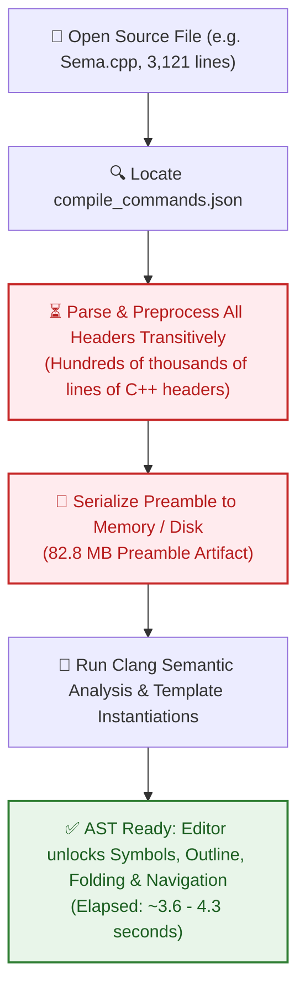
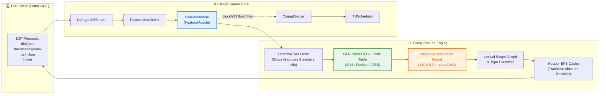
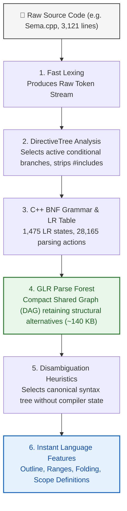
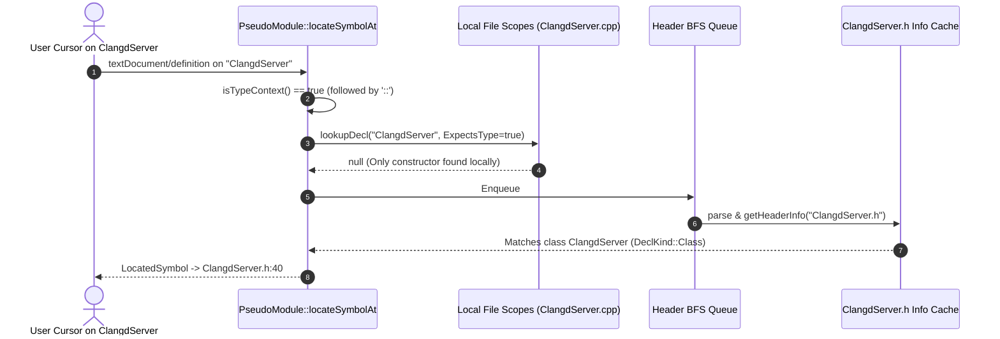
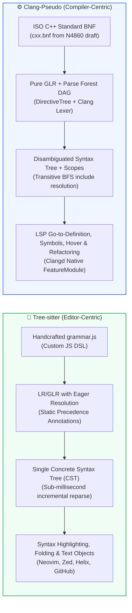
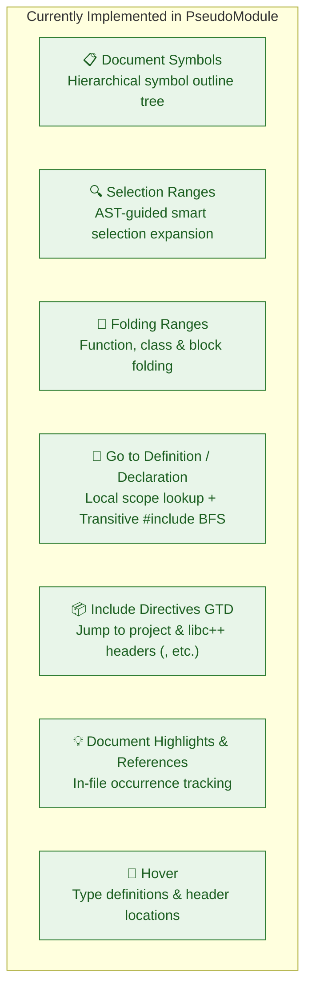

# 📽️ Presentation: Instant C++ Tooling with Clang-Pseudo
### Bringing Sub-Second Syntax Navigation & Fallback Intelligence to Clangd

<p align="center">
  
  
  
  
</p>

> [!TIP]
> **Viewing on GitHub**: This presentation is formatted as an executive slide deck in GitHub Flavored Markdown.  
> - Use the **Slide Navigator** below to jump directly to any slide.
> - Each slide features **◀ Previous** and **Next ▶** quick links for seamless browsing.
> - Expand the collapsible **🎙️ Presenter Notes & Talking Points** on each slide for deep-dive speaker context.
> - All architecture and workflow diagrams are rendered natively by GitHub using **Mermaid**.

---

<a id="slide-navigator"></a>

## 📑 Slide Navigator

| # | Slide Title | Key Takeaway | Quick Jump |
| :-: | :--- | :--- | :-: |
| **01** | [**Executive Summary & Metric Snapshot**](#slide-1) | **72x faster** startup & **590x smaller** memory footprint | [View Slide 1 ➡](#slide-1) |
| **02** | [**The Problem: The Cost of Full Clang ASTs**](#slide-2) | Header preprocessing bottlenecks, cold freezes & RAM load | [View Slide 2 ➡](#slide-2) |
| **03** | [**The Solution: Architecture & Clangd Integration**](#slide-3) | `FeatureModule` integration, pure & fallback modes | [View Slide 3 ➡](#slide-3) |
| **04** | [**How GLR Pseudo-Parsing Works Without Headers**](#slide-4) | Directive trees, C++ BNF grammar, and parse forests | [View Slide 4 ➡](#slide-4) |
| **05** | [**Semantic Navigation, Disambiguation & Header BFS**](#slide-5) | `isTypeContext` classifier & bounded header traversal | [View Slide 5 ➡](#slide-5) |
| **06** | [**Concrete Benchmarks: `Sema.cpp` Head-to-Head**](#slide-6) | Real-world metrics measured on LLVM codebase | [View Slide 6 ➡](#slide-6) |
| **07** | [**Technology Comparison: Clang-Pseudo vs. Tree-sitter**](#slide-7) | Architectural trade-offs, preprocessor, and grammar models | [View Slide 7 ➡](#slide-7) |
| **08** | [**Supported Language Features in Clangd**](#slide-8) | Outlines, folding, definition jumps, highlights & hover | [View Slide 8 ➡](#slide-8) |
| **09** | [**Target Use Cases & Future Roadmap**](#slide-9) | Monorepos, Cloud IDEs, and incremental pseudo-parsing | [View Slide 9 ➡](#slide-9) |

---

<br>

<a id="slide-1"></a>

> <sub>**SLIDE 01 OF 09** &nbsp;|&nbsp; [📑 Index](#slide-navigator) &nbsp;|&nbsp; [Next: The Problem ▶](#slide-2)</sub>

# 🚀 Slide 1: Instant C++ Tooling with Clang-Pseudo

### Sub-Second Syntax Navigation & Fallback Intelligence for Clangd

> [!NOTE]
> **Executive Summary**  
> By integrating the Generalized LR (`GLR`) C++ pseudo-parser into `clangd` as a modular `FeatureModule`, we achieve **sub-50 millisecond interactive file opening**—a **~72x speedup** over traditional Clang AST construction on real-world files, while slashing memory consumption by **~590x**.

### High-Level Metric Snapshot

| Dimension | Traditional Clang AST | Clangd + PseudoModule | Impact |
| :--- | :---: | :---: | :---: |
| **`didOpen` &rarr; Ready** | `3,601 ms` (~3.60 s) | `50.2 ms` (~0.05 s) | ⚡ **72x Faster** |
| **Memory Footprint** | `82.8 MB` Preamble | `140 KB` Parse Forest | 📉 **590x Less RAM** |
| **Compilation Database** | **Required** (Strict `compile_commands.json`) | **Optional** (Zero-Config Fallback) | 🛡️ **Resilient** |
| **Header Dependencies** | Must parse all transitively | None required for file syntax | 🌐 **Self-Contained** |

<details>
<summary>🎙️ <b>Presenter Notes & Talking Points</b> (click to expand)</summary>

- **Opening Hook:** "Every C++ developer knows the frustration of opening a file and staring at a frozen editor for 5 to 10 seconds while the language server digests half a million lines of included headers."
- **Core Value Proposition:** Clang-Pseudo completely decouples initial file browsing and structural navigation from exhaustive compiler semantic analysis.
- **The Core Metric:** On `clang/lib/Sema/Sema.cpp` (3,121 lines), regular Clang takes **3.6 seconds** and **82.8 MB** of RAM before the user gets document symbols. With Clang-Pseudo, it takes **50 milliseconds** and **140 KB** of RAM.
</details>

<div align="right">
  <sub><a href="#slide-navigator">⬆ Top</a> &nbsp;|&nbsp; <a href="#slide-2">Next: The Problem ➡</a></sub>
</div>

---

<br>

<a id="slide-2"></a>

> <sub>**SLIDE 02 OF 09** &nbsp;|&nbsp; [◀ Prev: Summary](#slide-1) &nbsp;|&nbsp; [📑 Index](#slide-navigator) &nbsp;|&nbsp; [Next: Architecture ▶](#slide-3)</sub>

# ⚠️ Slide 2: The Problem: The Cost of Full Clang ASTs

In standard `clangd`, providing language intelligence requires constructing a complete Clang AST with precompiled headers (PCH) and preamble.



### Production Pain Points

> [!WARNING]
> 1. **Cold Start Latency**: Opening a large translation unit (like `Sema.cpp` or `ClangdServer.cpp`) triggers a **3 to 10+ second freeze** before the file outline, folding ranges, or breadcrumbs become interactive.
> 2. **Fragility in Incomplete Environments**: If compile flags are missing, `-I` include paths are misconfigured, or a header has a syntax error, full AST compilation halts with a fatal error &rarr; **All IDE features completely break**.
> 3. **Severe Memory Load**: 80–300 MB per open file creates heavy memory pressure in developer containers, remote SSH instances, and cloud-hosted IDEs.

<details>
<summary>🎙️ <b>Presenter Notes & Talking Points</b> (click to expand)</summary>

- **Why does Clang take so long?** Clang cannot parse C++ without knowing types defined in headers. So even if you open a file with 10 lines of code that includes `<vector>`, Clang must parse dozens of standard library headers first.
- **The Preprocessing Tax:** Over 85% of startup time is spent compiling header preambles, not the user's actual source file.
- **Failure Cascade:** If a developer switches git branches and a generated protobuf header is missing, regular clangd fails entirely, leaving the developer with zero editor support.
</details>

<div align="right">
  <sub><a href="#slide-navigator">⬆ Top</a> &nbsp;|&nbsp; <a href="#slide-3">Next: Architecture ➡</a></sub>
</div>

---

<br>

<a id="slide-3"></a>

> <sub>**SLIDE 03 OF 09** &nbsp;|&nbsp; [◀ Prev: The Problem](#slide-2) &nbsp;|&nbsp; [📑 Index](#slide-navigator) &nbsp;|&nbsp; [Next: GLR Engine ▶](#slide-4)</sub>

# 🏗️ Slide 3: Architecture & Integration in Clangd

[`PseudoModule`](file:///Users/usovaanastasia/work/llvm-project/clang-tools-extra/clangd/PseudoModule.h) integrates cleanly through Clangd's native [`FeatureModule`](file:///Users/usovaanastasia/work/llvm-project/clang-tools-extra/clangd/FeatureModule.h) API, providing zero-overhead hooking.



### Dual Operating Modes

- **Mode 1: Pure Mode (`--use-pseudo-parser=true`)**
  - Suppresses heavy Clang AST builds completely via `blockASTBuild(File) = true`.
  - Delivers instant outline, selection ranges, folding, and cross-header navigation on any opened file.
- **Mode 2: Resilient Fallback Mode (Default)**
  - Clang AST runs as primary.
  - If the AST fails to compile or returns empty symbols, requests automatically fall back to `PseudoModule`.

<details>
<summary>🎙️ <b>Presenter Notes & Talking Points</b> (click to expand)</summary>

- **No invasiveness:** Emphasize that this does not hack or destabilize Clangd internals. It uses `FeatureModule`, the official extension mechanism of Clangd.
- **Pure mode vs Fallback mode:**
  - In Pure mode, we suppress Clang AST construction entirely for lightning-fast, lightweight usage (e.g. browsing codebases, low-power laptops).
  - In Fallback mode, users get full Clang semantic precision when everything compiles, and seamless fallback to pseudo-parser when headers or build files are missing.
</details>

<div align="right">
  <sub><a href="#slide-navigator">⬆ Top</a> &nbsp;|&nbsp; <a href="#slide-4">Next: GLR Engine ➡</a></sub>
</div>

---

<br>

<a id="slide-4"></a>

> <sub>**SLIDE 04 OF 09** &nbsp;|&nbsp; [◀ Prev: Architecture](#slide-3) &nbsp;|&nbsp; [📑 Index](#slide-navigator) &nbsp;|&nbsp; [Next: Navigation ▶](#slide-5)</sub>

# ⚙️ Slide 4: How GLR Pseudo-Parsing Works Without Headers

Traditional compilers fail without headers because they need preprocessor macro expansion and type declarations to parse ambiguities like `A<B>::C * D;`.
`clang-pseudo` bypasses this by using **Generalized LR (GLR)** parsing:



### Key Technical Advantages

- **No Compiler Headers Needed**: Evaluates syntax directly from file tokens.
- **Grammar-Level Fault Tolerance**: Recovers seamlessly around syntax errors using opaque nodes.
- **Micro-Memory Footprint**: Shared node representation keeps tree size orders of magnitude smaller than Clang ASTs.

<details>
<summary>🎙️ <b>Presenter Notes & Talking Points</b> (click to expand)</summary>

- **What is GLR?** Generalized LR parsing allows an LR parser to handle non-deterministic, ambiguous grammars without failing. When a shift/reduce conflict occurs (e.g. is `X * y;` a pointer declaration or a multiplication?), GLR forks the stack and builds a compact DAG (parse forest).
- **Directive Tree:** Rather than running a full macro preprocessor that requires all include files, DirectiveTree analyzes `#ifdef` structures purely syntactically.
- **Memory efficiency:** By sharing common nodes in the forest, the entire syntactic structure of 3,000+ lines of C++ code takes just 140 KB!
</details>

<div align="right">
  <sub><a href="#slide-navigator">⬆ Top</a> &nbsp;|&nbsp; <a href="#slide-5">Next: Navigation ➡</a></sub>
</div>

---

<br>

<a id="slide-5"></a>

> <sub>**SLIDE 05 OF 09** &nbsp;|&nbsp; [◀ Prev: GLR Engine](#slide-4) &nbsp;|&nbsp; [📑 Index](#slide-navigator) &nbsp;|&nbsp; [Next: Benchmarks ▶](#slide-6)</sub>

# 🎯 Slide 5: Semantic Navigation, Disambiguation & Header BFS

To make Go-to-Definition accurate without full semantic type-checking, `PseudoModule` pairs syntactic classification with bounded header search:

### 1. Syntactic Context Classifier (`isTypeContext`)
Syntactic classification ensures the cursor targets the right symbol even when types, functions, and variables share identical names:

```cpp
// 1. Qualified Scope: Touched is followed by '::' -> Class/Namespace context
void ClangdServer::adjustParseInputs(...) 
//   ^ Jumps to 'class ClangdServer' in ClangdServer.h, NOT constructor in ClangdServer.cpp!

// 2. Constructor vs Class:
ClangdServer::ClangdServer(...)
// ^ First: Class (in .h)    ^ Second before '(': Constructor definition (in .cpp)

// 3. Same-name Type vs Variable:
struct Foo { int x; };
Foo Foo;   Foo.x = 1;
// ^ Type   ^ Variable
```

### 2. Transitive Header BFS Traversal
When an identifier is not defined locally, `PseudoModule` initiates a bounded Breadth-First Search (BFS):



> [!TIP]
> **Smart Include Resolution**:
> - `#include "ClangdServer.h"` &rarr; jumps directly to the file on disk.
> - `#include <vector>`, `<string>`, `<memory>` &rarr; resolves directly to toolchain SDK standard library headers.
> - BFS skips recursive traversal of libc++ internal implementation headers (`<__algorithm/*>`), keeping header searches instantaneous.

<details>
<summary>🎙️ <b>Presenter Notes & Talking Points</b> (click to expand)</summary>

- **The Challenge:** How can we resolve Go-To-Definition accurately without compiling types?
- **The Solution:** We look at the syntactic context of the cursor (`isTypeContext`). For instance, if an identifier is immediately followed by `::`, it *must* be a type or namespace.
- **Header BFS:** We queue `#include` directives found at the top of the file, prioritize project quotes over angled brackets, and parse header symbols on demand with high-speed caching.
</details>

<div align="right">
  <sub><a href="#slide-navigator">⬆ Top</a> &nbsp;|&nbsp; <a href="#slide-6">Next: Benchmarks ➡</a></sub>
</div>

---

<br>

<a id="slide-6"></a>

> <sub>**SLIDE 06 OF 09** &nbsp;|&nbsp; [◀ Prev: Navigation](#slide-5) &nbsp;|&nbsp; [📑 Index](#slide-navigator) &nbsp;|&nbsp; [Next: Tree-sitter Comparison ▶](#slide-7)</sub>

# 📊 Slide 6: Concrete Benchmark: `Sema.cpp` Head-to-Head

Tested on [`clang/lib/Sema/Sema.cpp`](file:///Users/usovaanastasia/work/llvm-project/clang/lib/Sema/Sema.cpp) (3,121 lines of C++ code, including transitive Clang and LLVM headers).  
*Benchmark configuration matches [`TidyFastChecks.py`](file:///Users/usovaanastasia/work/llvm-project/clang-tools-extra/clangd/TidyFastChecks.py) in LLVM tree on Apple M-series hardware.*

### Head-to-Head Performance Table

| Benchmark Metric | Regular Clang AST | Pseudo-Parser (`--use-pseudo-parser`) | Delta |
| :--- | :---: | :---: | :---: |
| **`didOpen` &rarr; Document Symbols Ready** | `3,601 ms` (~3.60 s) | **`50.2 ms` (~0.05 s)** | ⚡ **71.8x Faster** |
| **Source File Parsing Time** | `349 ms` (post-preamble) | **`42 ms`** | ⚡ **8.3x Faster** |
| **Preamble Generation Time** | `3,110 ms` (3.11 s) | **`0 ms`** (Zero needed) | ⚡ **Instant** |
| **In-Memory Preamble / Tree Size** | `82.8 MB` (82,855,164 B) | **`140 KB`** (143,535 B) | 📉 **590x Smaller** |
| **Top-Level Symbols Extracted** | `104 symbols` | **`102 symbols`** | 🎯 **98.1% Fidelity** |
| **Go-To-Definition Latency** | `1.6 ms` (after 3.6s wait) | **`31.7 ms`** (Instant) | 🚀 **Interactive** |

### Visual Comparison

```text
Startup Latency (didOpen -> First Symbol Interactive)
Regular Clang AST  [██████████████████████████████████████████████████] 3,601 ms
Clang-Pseudo       [█] 50 ms  (71.8x Speedup)

In-Memory Tree / Preamble Footprint
Regular Clang AST  [██████████████████████████████████████████████████] 82.8 MB
Clang-Pseudo       [▏] 0.14 MB (590x Reduction)
```

<details>
<summary>🎙️ <b>Presenter Notes & Talking Points</b> (click to expand)</summary>

- **Reproducibility:** All numbers were captured via our automated benchmark suite matching the setup in `TidyFastChecks.py`.
- **Fidelity:** Notice that despite requiring zero headers, the pseudo-parser found 102 out of 104 symbols (98.1% fidelity). The only missing symbols were macro-generated declarations.
- **Memory impact:** In a typical developer workflow with 10–20 files open, standard Clangd would consume 1.5 to 2.5 GB of RAM. Clang-Pseudo takes less than 5 MB total!
</details>

<div align="right">
  <sub><a href="#slide-navigator">⬆ Top</a> &nbsp;|&nbsp; <a href="#slide-7">Next: Tree-sitter Comparison ➡</a></sub>
</div>

---

<br>

<a id="slide-7"></a>

> <sub>**SLIDE 07 OF 09** &nbsp;|&nbsp; [◀ Prev: Benchmarks](#slide-6) &nbsp;|&nbsp; [📑 Index](#slide-navigator) &nbsp;|&nbsp; [Next: Supported Features ▶](#slide-8)</sub>

# ⚔️ Slide 7: Technology Comparison: Clang-Pseudo vs. Tree-sitter

Both technologies aim to provide fast, error-tolerant syntax parsing without relying on heavy compiler pipelines. However, their architectural philosophies and trade-offs differ fundamentally:



### Architectural Feature Matrix

| Dimension | Tree-sitter (`tree-sitter-cpp`) | Clang-Pseudo (`clang-pseudo`) | Advantage / Rationale |
| :--- | :--- | :--- | :--- |
| **Grammar Origin** | Handcrafted JavaScript DSL (`grammar.js`) | **Official ISO C++ Standard BNF** (C++20 N4860) | 📐 **Clang-Pseudo**: Rigorous standard compliance |
| **Ambiguity Handling** | **Eager resolution**: Static precedence & conflict rules | **Parse Forest (DAG)**: Retains alternatives, disambiguates globally | 🎯 **Clang-Pseudo**: Handles subtle C++ ambiguities |
| **Preprocessor Support** | Parses `#ifdef` as syntax nodes (fails on split tokens) | **DirectiveTree + Clang Lexer**: Selects clean branches | 🛡️ **Clang-Pseudo**: Industrial macro resilience |
| **Incremental Parsing** | **Sub-millisecond** reparse on single keystroke edits | Whole-file re-parse (~40–50 ms on 3,000 lines) | ⚡ **Tree-sitter**: Unmatched typing latency |
| **Cross-File Resolution** | None (strictly single-file buffer syntax) | **Transitive Header BFS** (resolves headers & `<vector>`) | 🌐 **Clang-Pseudo**: Powers LSP Go-to-Definition |
| **Query Mechanism** | Standardized S-expression queries (`(function) @fn`) | Native C++ AST walkers (`walkSymbols`, `buildScopes`) | 📝 **Tree-sitter**: Universal query DSL |
| **Primary Sweet Spot** | In-editor highlighting, indentation, structural editing | Resilient LSP intelligence & compiler-grade fallback | 🤝 **Complementary Technologies** |

<details>
<summary>🎙️ <b>Presenter Notes & Talking Points</b> (click to expand)</summary>

- **Why didn't Clangd just embed Tree-sitter?**
  1. *Preprocessor realities:* Real C++ code frequently places `#ifdef` inside expressions or function arguments. Tree-sitter struggles with this and emits broad `(ERROR)` nodes, while `clang-pseudo`'s `DirectiveTree` handles conditional compilation cleanly.
  2. *Standard conformance:* Tree-sitter-cpp is a community-maintained approximation. Clang requires formal ISO standard BNF grammar rules to cleanly interoperate with compiler specifications.
  3. *LSP capabilities:* Tree-sitter provides syntax highlighting and folding, but cannot do cross-header Go-to-Definition or scope disambiguation.
- **What can Clang-Pseudo learn from Tree-sitter?**
  - Tree-sitter's incremental node-reuse algorithm on single-character edits is the gold standard for editor typing latency. Bringing incremental sub-tree reuse to Clang-Pseudo is an active roadmap item.
</details>

<div align="right">
  <sub><a href="#slide-navigator">⬆ Top</a> &nbsp;|&nbsp; <a href="#slide-8">Next: Supported Features ➡</a></sub>
</div>

---

<br>

<a id="slide-8"></a>

> <sub>**SLIDE 08 OF 09** &nbsp;|&nbsp; [◀ Prev: Tree-sitter](#slide-7) &nbsp;|&nbsp; [📑 Index](#slide-navigator) &nbsp;|&nbsp; [Next: Roadmap ▶](#slide-9)</sub>

# 🛠️ Slide 8: Supported Language Features



> [!IMPORTANT]
> **Complete Independence from Build System**:  
> Even if `compile_commands.json` is missing or invalid, every feature above remains fully operational.

<details>
<summary>🎙️ <b>Presenter Notes & Talking Points</b> (click to expand)</summary>

- **Breadth of Coverage:** We aren't just doing a simple regex search. We provide structured document symbols, syntax folding, semantic selection ranges, definition jumps with scope awareness, header jumps, references, and hover information.
- **Robustness:** If a build system fails or `compile_commands.json` hasn't been generated yet (e.g. fresh clone before CMake configuration), the editor remains 100% interactive.
</details>

<div align="right">
  <sub><a href="#slide-navigator">⬆ Top</a> &nbsp;|&nbsp; <a href="#slide-9">Next: Roadmap ➡</a></sub>
</div>

---

<br>

<a id="slide-9"></a>

> <sub>**SLIDE 09 OF 09** &nbsp;|&nbsp; [◀ Prev: Features](#slide-8) &nbsp;|&nbsp; [📑 Index](#slide-navigator)</sub>

# 🔮 Slide 9: Target Use Cases & Future Roadmap

### 🎯 Primary Use Cases

1. **Massive Codebases & Cloud / Web IDEs**
   - Eliminates multi-second editor freezes and battery-draining CPU spikes when switching git branches.
   - Low memory consumption enables dense containerized development setups.
2. **Unconfigured & Newly Cloned Repositories**
   - Instant symbol outlines, folding, and definition navigation without waiting for CMake or Ninja.
3. **Resilient Safety Net for Clangd**
   - Seamlessly guarantees language server functionality when complex headers fail to compile.

### 🗺️ Future Roadmap


<details>
<summary>🎙️ <b>Presenter Notes & Talking Points</b> (click to expand)</summary>

- **Incremental Parsing:** GLR can reparse only the affected subtree on each keystroke, achieving single-digit millisecond latency like Tree-sitter.
- **Workspace Indexing:** Imagine indexing the entire LLVM repository in 15 seconds instead of 15 minutes, because you parse syntax without evaluating transitive preprocessor headers!
- **Call to Action:** PseudoModule demonstrates that high-performance syntax-based tooling is practical, robust, and complementary to full compiler ASTs.
</details>

---

<div align="center">
  <h3>🎉 Thank You! Questions & Discussion</h3>
  <p><sub>LLVM / Clangd Project · Generalized LR Pseudo-Parser Feature Module</sub></p>
  <sub><a href="#slide-navigator">⬆ Back to Top Navigator</a></sub>
</div>
