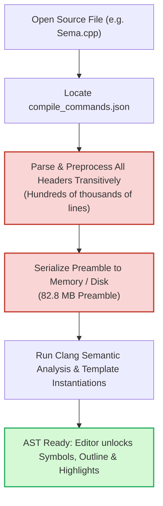
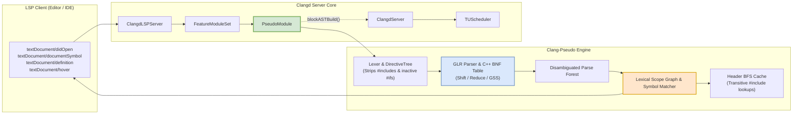
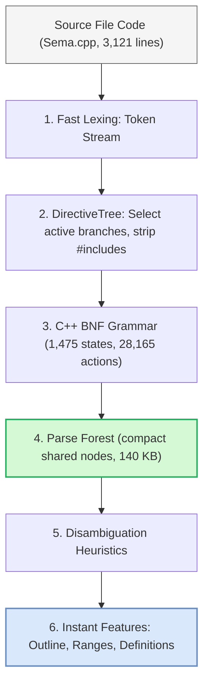
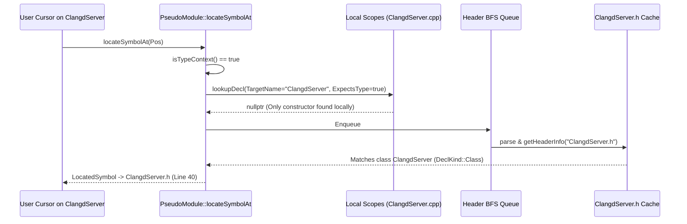
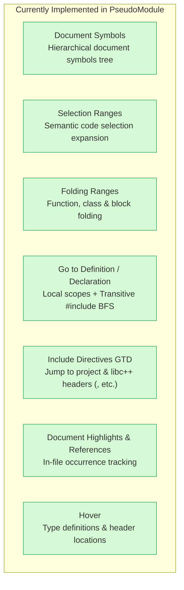

# Instant C++ Tooling with Clang-Pseudo: Bringing Sub-Second Syntax Navigation & Fallback to Clangd

````carousel
<!-- slide -->
# Instant C++ Tooling with Clang-Pseudo
### Bringing Sub-Second Syntax Navigation & Fallback Intelligence to Clangd

**Presenter:** Google DeepMind / LLVM Tooling Pair  
**Core Components:**
- [`PseudoModule`](file:///Users/usovaanastasia/work/llvm-project/clang-tools-extra/clangd/PseudoModule.h) (Feature Module in Clangd)
- `clang-pseudo` (GLR C++ Pseudo-Parser)
- `ClangdServer` & `FeatureModule` Architecture

---

### Key Takeaway
> [!NOTE]
> By integrating the Generalized LR (`GLR`) C++ pseudo-parser into `clangd`, we achieve **sub-50 millisecond interactive file opening**—a **~72x speedup** over traditional Clang AST construction, while slashing memory consumption by **~590x**.

```
[ Traditional Clang AST ]      didOpen -> Ready: ~3,600 ms   |   Memory: ~83 MB
[ Clangd + PseudoModule ]      didOpen -> Ready:     50 ms   |   Memory: 140 KB
                               (72x Faster Startup)              (590x Less RAM)
```

<!-- slide -->
# The Problem: The Cost of Full Clang ASTs

In standard `clangd`, providing language intelligence requires constructing a complete Clang AST with precompiled headers (PCH) and preamble.



### Pain Points in Production:
1. **Preamble Build Bottleneck**: Large translation units take **3 to 10+ seconds** on cold start before any outline, folding, or navigation is available.
2. **Fragility in Incomplete Environments**: If compile commands are missing, flags are invalid, or a third-party dependency is missing, AST compilation fails entirely $\implies$ **Zero IDE features available**.
3. **Severe Memory Pressure**: 80–300 MB of RAM per open file makes background indexing and multi-file editing heavyweight on developer laptops and cloud containers.

<!-- slide -->
# The Solution: Architecture & Integration in Clangd

[`PseudoModule`](file:///Users/usovaanastasia/work/llvm-project/clang-tools-extra/clangd/PseudoModule.h) plugs directly into Clangd via the [`FeatureModule`](file:///Users/usovaanastasia/work/llvm-project/clang-tools-extra/clangd/FeatureModule.h) extension point, offering two operating modes:
1. **Fallback Mode**: Complements standard AST when compilation commands fail or AST yields no symbols.
2. **Pseudo-Only Mode (`--use-pseudo-parser=true`)**: Disables heavy AST builds completely for instant syntax navigation.



<!-- slide -->
# How GLR Pseudo-Parsing Works Without Headers

Traditional compilers fail when a header is missing because they cannot resolve types or template definitions.
`clang-pseudo` bypasses this by using a **Generalized LR (GLR)** parser:



### Key Technical Properties:
- **Header-Independent**: Operates strictly on the tokens of the opened file.
- **Tolerant to Broken Syntax**: Recovers from incomplete code or missing declarations using opaque nodes and grammar alternatives.
- **Deterministic Disambiguation**: Uses structural heuristics (e.g. favoring declarations over expressions in statement context) to pick the canonical parse.

<!-- slide -->
# Semantic Navigation: Disambiguation & Header BFS

To make Go-to-Definition accurate without full semantic ASTs, `PseudoModule` implements two key mechanisms:

### 1. Contextual Type vs. Value Disambiguation (`isTypeContext`)
Syntactic classification ensures the cursor targets the right symbol even when types and values share the same name:
- **`ClangdServer::adjustParseInputs`** $\rightarrow$ `Touched` is followed by `::` $\implies$ **Type context**. Skips constructor definition in `.cpp` and resolves to `class ClangdServer` in `.h`.
- **`ClangdServer::ClangdServer(...)`** $\rightarrow$ First is **Class** (jumps to header), second before `(` is **Constructor** (jumps to constructor).
- **`Foo Foo; Foo.x = 1;`** $\rightarrow$ First `Foo` resolves to `struct Foo`; second and third resolve to local variable `Foo`.

### 2. Transitive Header BFS Search
When a type is declared in a header, `PseudoModule` performs bounded Breadth-First Search (BFS):



<!-- slide -->
# Concrete Benchmark: Sema.cpp Head-to-Head

Tested on [`clang/lib/Sema/Sema.cpp`](file:///Users/usovaanastasia/work/llvm-project/clang/lib/Sema/Sema.cpp) (3,121 lines) using the official test suite setup from [`TidyFastChecks.py`](file:///Users/usovaanastasia/work/llvm-project/clang-tools-extra/clangd/TidyFastChecks.py):

| Benchmark Metric | Regular Clang AST | Pseudo-Parser (`--use-pseudo-parser`) | Improvement |
| :--- | :--- | :--- | :--- |
| **`didOpen` $\rightarrow$ Document Symbols Ready** | **3,601 ms** (3.60 s) | **50.2 ms** (0.05 s) | **71.8x Faster** ⚡ |
| **Source File Parsing Time** | 349 ms (after preamble) | **42 ms** | **8.3x Faster** ⚡ |
| **Preamble Generation Time** | **3,110 ms** (3.11 s) | **0 ms** (Not needed) | **$\infty$** |
| **In-Memory Tree / Preamble Size** | **82.8 MB** (82,855,164 B) | **140 KB** (143,535 B) | **590x Smaller** 📉 |
| **Symbol Count Extracted** | 104 symbols | 102 symbols | **98.1% Fidelity** |
| **Go-To-Definition Latency** | 1.6 ms (after 3.6s wait) | **31.7 ms** (Instant) | **Interactive Sub-Frame** |

```
Startup Latency (didOpen -> Interactive)
Regular Clang AST  [██████████████████████████████████████████████████] 3,601 ms
Clang-Pseudo       [█] 50 ms  (72x Speedup)

Memory Footprint
Regular Clang AST  [██████████████████████████████████████████████████] 82.8 MB
Clang-Pseudo       [▏] 0.14 MB (590x Reduction)
```

<!-- slide -->
# Supported Language Features & Capabilities



> [!TIP]
> **Zero Configuration Requirement**: Even with no `compile_commands.json` on disk, all above features function with high precision.

<!-- slide -->
# Target Use Cases & Impact

1. **Massive Codebases & Remote Cloud IDEs**
   - Eliminates CPU spikes and multi-second freezes when switching git branches or opening newly created files.
   - Low memory consumption enables high-density containerized development environments.

2. **Unconfigured / Newly Cloned Repositories**
   - Immediate out-of-the-box navigation before CMake/Ninja configuration runs.
   - Fault-tolerant browsing for C and C++ projects.

3. **Fallback Resiliency in Production `clangd`**
   - Automatically takes over when standard AST generation crashes or encounters syntax errors in broken headers.

4. **Future Roadmap**
   - Incremental GLR parsing on keystroke.
   - Text-based approximate code completion without compiler invocation.
   - Syntax-directed fast refactoring (variable rename across single translation units).
````
